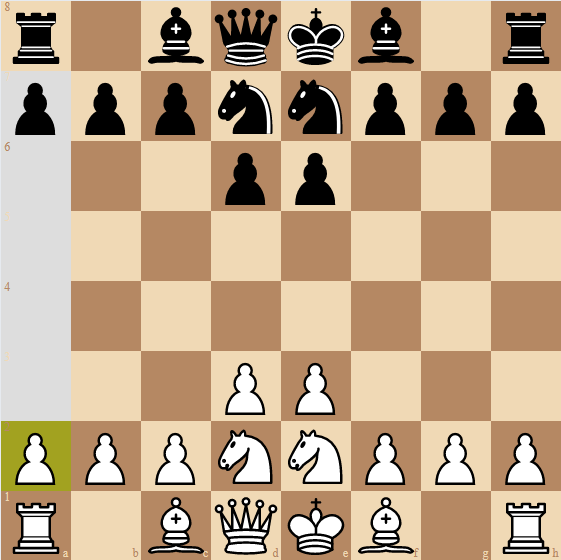

# Psy(chic) Chess

**Warning**: This application is in alpha, and the code is both largely undocumented and minimally tested. Peruse at your own peril.

## About

### Game Rules

The rules are a little confusing but make sense with some explanation.
In short, in Psychic Chess, no piece can move on its own -- it must be moved "telepathically" by its allies!

One way to conceptualize these movements is the way that piece types "see" different squares.
In normal chess, different types of pieces move in different ways on the board.
A knight moves in an L shape, bishops move diagonally until they reach an obstacle, etc.
In Psychic Chess, pieces "see" pieces that they would be "defending" in regular chess.
When a piece "sees" an ally, the ally can move with the properties of the supporting piece.

For example, consider the example below. The pawn on a2 is selected.

In normal chess, the rook defends the a2 square.
In PsychicChess, the pawn on a2 has "rook powers" and can move vertically and horizontally, even enabling the capture of the a7 pawn.

We can think of this as the rook using psychic powers to help the pawn move!

One confusing case is the pawn, which attacks differently from how it moves:

Pawns give "pawn powers" only when allied pieces are in their "attack" squares.
(That is, "doubled" pawns do not support each other.)
If a piece has "pawn powers", it can either push forward one square or capture diagonally.
En passent and double-move are not supported.

### How To Win

The game is won when you capture the enemy king or force the enemy into "stalemate" (i.e. they run out of moves).
It is impossible to draw in PsychicChess.

### Origin

I found this game through someone I used to work with named Bojan.
(It's original name was "Bojanchess".)
I have adapted it slightly for ease of implementation (and to my own liking).
Thanks Bojan!
Supposedly, it has origins from [Knight Relay Chess](https://en.wikipedia.org/wiki/Knight_relay_chess), but the history is unclear.

## Application

### Website

The website is deployed at [psychess.net](https://www.psychess.net/).

Hit "Play" to connect to a game against an opponent.
Game results are currently not implemented, so refresh to play more games... x)

Hit "Analyze" to toy around. There's issues here too. Whoops!

### Stack

The stack has a few key parts:

- the core library, `/chess`: a rust implementation of the rules of PsychicChess
- the terminal renderer, `/terminal`: a rust binary app for playing PsychicChess in terminal
    - not recently tested, might be buggy
- `/scripts`: utility scripts to show how modules are built, run locally, and deployed
- the wasm build lib, `/wasm`: a wasm wrapper for engaging with core code in any wasm-friendly env
    - `/scripts/build.sh` outputs this build into the appropriate directory in `/web` and can copy it elsewhere.
- the web application, `/web`: a deno/oak/react app using firebase
    - `/web/client`: defines react code for the client bundle
    - `/web/common`: utilities used in both server and browser code; wasm build target
    - `/web/server`: handles bundling client, serving static files, ws connections, and REST api calls
    - import-map specifies all dependencies and is used for both client and server imports
    - typescript-first since it's deno
- windows-client: entirely TODO but this would be really cool wouldn't it?

## Next Steps

I'm not going to work on this for a little bit but updates should come soon :)
